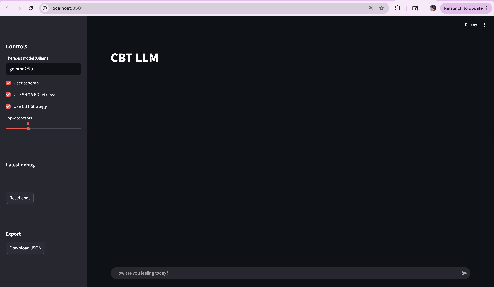
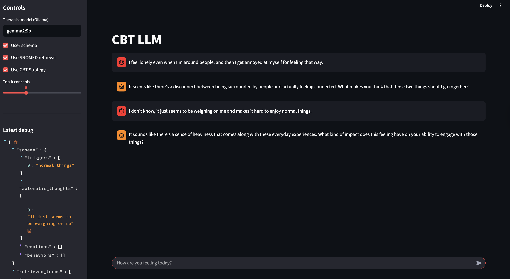

# cbt-llm
CMSC691: CBT Oriented LLMs

## Project Setup

```
git clone https://github.com/cbt-llm/cbt-llm.git
cd cbt-llm
cp .env.example .env
```

### Add PyMedTermino-0.3.2
 
1. Under ```external_libs``` add the PyMedTermino-0.3.2 folder

2. Update ```external_libs/PyMedTermino-0.3.2/setup.py``` with the following:
```
import os
SNOMEDCT_DIR = os.getenv("SNOMEDCT_DIR")
SNOMEDCT_CORE_FILE = os.getenv("SNOMEDCT_CORE_FILE")
```


### Add SNOMED CT Data

PyMedTermino requires access to the official SNOMED CT distribution, which is protected by a copyright license. 
So we will not be committing it to the repo. You can obtain the license and then upload the release files locally 
into the project's ```data/external/snomed``` directory.

Accordingly, add the relative path to your ```.env```

It should look like:

```
SNOMEDCT_DIR = "data/external/snomed/SnomedCT_RF2Release_INT_20160731"
SNOMEDCT_CORE_FILE = "data/external/snomed/SNOMEDCT_CORE_SUBSET_201611/SNOMEDCT_CORE_SUBSET_201611.txt"
```

These paths point to the directory and core file that PyMedTermino will use. Then continue as follows:

```
python3 -m venv .venv
source .venv/bin/activate
make install
```

If make install fails:
```
pip install -e .
pip install external_libs/PyMedTermino-0.3.2
```

## Graph Setup

Create a Neo4j Instance and add the uri, username, password to your ```.env```

### Load From PymedTermino
```python -m cbt_llm.pymed_loader```

### Load SNOMED Concepts/Relationships to neo4j Graph
```python -m cbt_llm.pymed_graph```

## Graph Retrieval

### Create node embeddings and store in the graph
```python3 embed_snomed.py```


To check if the embeddings have been created in the neo4j
Run this below command in neo4j desktop/browser

```MATCH (n:Concept) WHERE n.embedding RETURN n.code AS code, size(n.embedding) AS embedding_size LIMIT 5```

### Install the Graph Data Science Plugin on the Neo4j Desktop 
This is used for semantic search. 

### Retrieve the tok_k embeddings
```python3 main.py```

## Start User Interface

From the root directory, run: ```streamlit run app.py```




## Run RAG Experiments

We evaluate CBT-aligned retrieval-augmented generation using a 2 × 3 factorial design, varying:

- Prompting mode: baseline vs. CBT-guided
- Language model: three open and closed LLMs

2 × 5 factorial design

Models mapping to experiment with:
- gemma-2-2b (arg: gemma)
- mistral-7b-instruct (arg: mistral)
- gpt-4o (arg: gpt)

Each model is run under baseline and CBT-guided system prompts.
Outputs are written to output/{model}/.

Commands to run:

```sh
export PYTHONPATH=src
export OPENAI_API_KEY=
```

```./run_experiments.sh [baseline|cbt] ${MODEL}```

## Generate Evaluation Plots

#### Therapist-Side Evaluation

We evaluate therapist responses using an LLM-as-a-judge framework that scores:

- Validation & reflection
- Socratic questioning
- Cognitive reframing
- Overall CBT quality

Outputs are saved to:

```
evaluation/{model}/summary.csv
evaluation/{model}/*.judge.jsonl
```

Commands:

```python src/cbt_llm/plot_cbt_eval.py --models gpt gemma mistral```

#### Patient-Side Sentiment Evaluation

Patient responses are analyzed using VADER compound sentiment scores as a proxy for emotional trajectory.

Generate Patient Evaluation Plots

This script produces:

Patient sentiment trajectories (baseline vs. CBT-guided)

Protocol-specific patient sentiment effects

Cross-model aggregated patient effect

```python src/cbt_llm/plot_patient_eval.py --models gpt gemma mistral```

Outputs are saved to:

```
evaluation/patient_plots/
```


