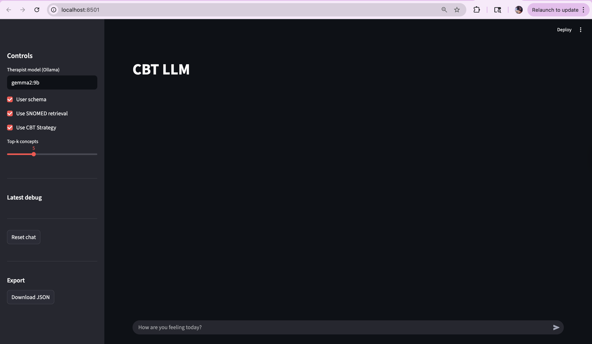
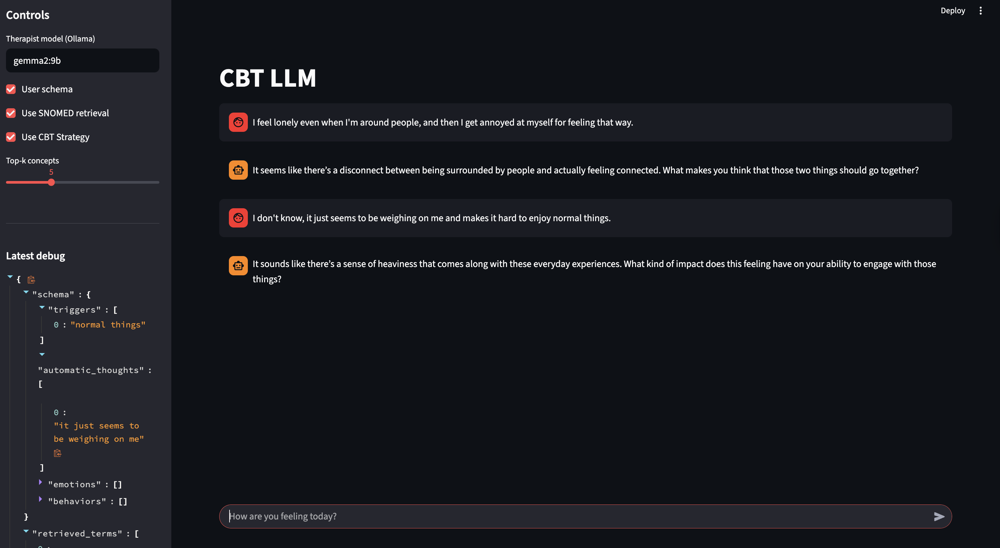

# cbt-llm
CMSC691: CBT Oriented LLMs

## Project Setup

```sh
git clone https://github.com/cbt-llm/cbt-llm.git
cd cbt-llm
cp .env.example .env
```

## CoreIssue Dataset: User Case Studies

Dataset containing 200 user seed queries that aim to study core issues as case studies. We commit 152 instances (found under `data/processed/user_case_studies.json`) derived from **RealCBT and ESConv**. The remaining 48 come from **SWMH** (gated, request access with an institutional email).

Run `python -m cbt_llm.utils.build_dataset` to build the dataset with **SWMH** . 

#### RealCBT Setup
 
Download RealCBT Dataset zip at ([RealCBT](https://gitlab.com/xiaoyi.wang/realcbt-dataset)), unzip and place under `data/external/RealCBT/`. The curated seed queries are available under `data/processed/realcbt.json` sampling all 76 transcripts.

#### ESConv Setup

76 randomly sampled rom the train split with situation labeled as the seed query and problem_type as core issue.

#### SWMH Setup

Request access with an institutional email. Keeps `depression`/`SuicideWatch` labeled text only, drops `[deleted]`/`[removed]` and `Edit:` footers, using texts that are under 700 chars. Randomly sampled 48 datapoints.

Each record has `id` (`1` to `200`), `source` (RealCBT, ESConv or SWMH), `user_case_seed_query`, and `core_issue`.

| Dataset | n | `source` | seed text | labels used |
|---|---|---|---|---|
| [RealCBT](https://gitlab.com/xiaoyi.wang/realcbt-dataset) | 76 | `realcbt_<transcript>_client_<utterance>` | selecting one client utterance from transcript to represent core issue | 8 issues (career, self-esteem, anxiety, relationships, health, financial, academic, other) |
| [ESConv](https://huggingface.co/datasets/thu-coai/esconv) | 76 | `esconv_<train_row>` | using `situation` from existing dataset | 13 issues (ongoing depression, job crisis, breakup with partner, problems with friends, academic pressure, sleep problems, procrastination, alcohol abuse, appearance anxiety, conflict with parents, issues with children, issues with parents, school bullying) |
| [SWMH](https://huggingface.co/datasets/AIMH/SWMH) | 48 | `swmh_<train_row>` | Reddit post text body | depression, SuicideWatch |


### Add PyMedTermino-0.3.2
 
1. Under ```external_libs``` add the PyMedTermino-0.3.2 folder

2. Update ```external_libs/PyMedTermino-0.3.2/setup.py``` with the following:
```sh
import os
SNOMEDCT_DIR = os.getenv("SNOMEDCT_DIR")
SNOMEDCT_CORE_FILE = os.getenv("SNOMEDCT_CORE_FILE")
```


### Add SNOMED CT Data

PyMedTermino requires access to the official SNOMED CT distribution, which is protected by a copyright license. 
So we will not be committing it to the repo. You can obtain the license and then upload the release files locally 
into the project's ```data/external/snomed``` directory.

Accordingly, add the relative path to your ```.env```

It should look like:

```sh
SNOMEDCT_DIR = "data/external/snomed/SnomedCT_RF2Release_INT_20160731"
SNOMEDCT_CORE_FILE = "data/external/snomed/SNOMEDCT_CORE_SUBSET_201611/SNOMEDCT_CORE_SUBSET_201611.txt"
```

These paths point to the directory and core file that PyMedTermino will use. Then continue as follows:

```sh
python3 -m venv .venv
source .venv/bin/activate
make install
```

If make install fails:
```sh
pip install -e .
pip install external_libs/PyMedTermino-0.3.2
pip install -r requirements.txt
```

## Graph Setup

Create a Neo4j Instance and add the uri, username, password to your ```.env```

### Load From PymedTermino
```python -m cbt_llm.pymed_loader```

### Load SNOMED Concepts/Relationships to neo4j Graph
```python -m cbt_llm.pymed_graph```

## Graph Retrieval

### Create node embeddings and store in the graph
```python -m cbt_llm.main```


To check if the embeddings have been created in the neo4j
Run this below command in neo4j desktop/browser

```MATCH (n:Concept) WHERE n.embedding RETURN n.code AS code, size(n.embedding) AS embedding_size LIMIT 5```

### Install the Graph Data Science Plugin on the Neo4j Desktop 
This is used for semantic search. 

### Retrieve the top_k embeddings

```sh
python -m cbt_llm.main
```

Select option `1` (Neo4j SNOMED retrieval).

Output written to:
```
src/output_files/neo4j_retrival_output/snomed_turn_results.csv
```

Columns: `Embedding, Turn, User Text, SNOMED Term, Code, Score, Relation Type, Relation Target Code, Relation Target Term`


## NLI Re-ranking

After SNOMED retrieval, a Natural Language Inference (NLI) re-ranking layer filters noisy top-K findings using `cross-encoder/nli-deberta-v3-small`.

### How it works

For each retrieved SNOMED finding, a hypothesis is constructed from the finding term:

```
"This person has loss of control of anger (finding)."
```

The NLI model scores `(user_text, hypothesis)` pairs and assigns a decision:

| NLI Label     | Condition                         
| ------------- | --------------------------------- 
| ENTAILMENT    | highest score                     
| NEUTRAL       | highest score AND score ≥ 0.5     
| CONTRADICTION | highest score                     

### Run

```sh
python -m cbt_llm.main
```

Select option `4` (NLI re-ranking).

Or run directly without loading the embedding models:

```sh
python -c "from cbt_llm.pipelines.nli_reranker import run_nli_reranker; run_nli_reranker()"
```

### Outputs

Both files are written to `src/output_files/neo4j_retrival_output/`.

**`nli_reranked_results.csv`** — full results with NLI scores and decision per finding:

```
Turn, User Text, SNOMED Term, Code, Retrieval Score, Hypothesis,
NLI Label, Entailment Score, Neutral Score, Contradiction Score, Decision
```

**`nli_findings.json`** — all SNOMED findings per turn grouped by NLI label, for use in prompt integration:

```json
{
  "1": {
    "entailment": ["Breakup of romance (finding)", "Anticipatory anxiety (finding)"],
    "neutral": ["Anxiety about resuming sexual relations (finding)"],
    "contradiction": ["Able to remember today's date (finding)"]
  },
  "2": {
    "entailment": ["Anger (finding)"],
    "neutral": ["Loss of control of anger (finding)"],
    "contradiction": []
  }
}
```

---

## Live LLM Prompt Integration

For real-time use during inference (i.e., when the LLM processes a patient turn), use `FindingsPipeline` instead of the batch CSV pipeline. It combines SNOMED retrieval and NLI re-ranking in a single in-memory call — no CSV files involved.

### Usage

```python
from neo4j import GraphDatabase
from cbt_llm.pipelines.findings_pipeline import FindingsPipeline

driver = GraphDatabase.driver(uri, auth=(user, password))
pipeline = FindingsPipeline(driver, k=5, neutral_threshold=0.5)

findings = pipeline.get_findings("I don't know why I keep blowing up at people.")
# {
#   "entailment":    ["Unable to control anger (finding)", ...],
#   "neutral":       ["Tends to allow anger to build up (finding)"],
#   "contradiction": ["Able to control anger (finding)"]
# }
```

- `k`: number of SNOMED concepts retrieved per query (default: 5)
- `neutral_threshold`: minimum probability for a NEUTRAL finding to be kept (default: 0.5)

The NLI model is loaded once on `FindingsPipeline()` construction and reused for all subsequent calls.

---

## Set Up LLMs

### Ollama (for local open models)

This project uses **Ollama** to run open-source LLMs locally (e.g., Gemma, Mistral).

1. **Install Ollama**

Follow the official installation instructions for your OS:
[https://ollama.com/download](https://ollama.com/download)

Verify installation:

```sh
ollama --version
```

2. **Pull required models**

Pull the models used in the experiments:

```sh
ollama pull (model name)
```

3. **Start the Ollama server**

Ollama must be running before launching the UI or experiments:

```sh
ollama serve
```

> Leave this process running in a separate terminal.
### OpenAI (for closed models)


#### Model used for user simulation: `GPT-4o-mini`

To run user simulation (GPT-4o-mini) and evaluation (GPT-5.1), set your OpenAI API key:

```sh
export OPENAI_API_KEY=your_api_key_here
```

## Start User Interface

1. **Start Ollama (required for local models)**

In a separate terminal:

```sh
ollama serve
```

2. **Launch the Streamlit app**

From the project root directory:

```sh
export PYTHONPATH=src
streamlit run app.py
```

Once running, open the provided local URL in your browser.




---

### Prerequisites

* Ollama server running (for response generation)
* OpenAI API key set (for user simulation)

```sh
ollama serve
export PYTHONPATH=src
export OPENAI_API_KEY=your_api_key_here
```

We experiment CBT-aligned retrieval-augmented generation using a factorial design, varying:

* **Prompting mode**: Baseline vs. CBT Chain-of-Thought (CoT) and Multiple Chains-of-Thought (McoT)
* **Language model**: four open source LLMs

Command for modes:
- run under **baseline**, **cbt** and **cbt-mcot** system prompts modes.


This results in a **3 × 4 factorial design**.

### Models used for generation

| Model               | Argument  | Backend    |
| ------------------- | --------- | ---------- |
| Mistral 7B          | `mistral` | Ollama     |
| DeepSeek R1 8B      | `deepseek`| Ollama     |
| Gemma3-12B          | `gemma`   | Ollama     |
| GPT-OSS-20B         | `gpt`     | Ollama     |


Outputs are written to:

```
output/{model}/{mode}_transcript_{number}.json
```

### Run experiments

1. Compute Retrieval Recall Scores:
Evaluate SNOMED CT concept retrieval performance across the following embedding models:

- MPNet (all-mpnet-base-v2)
- SapBERT (SapBERT-from-PubMedBERT-fulltext)
- BioRedditBERT
- MentalBERT

```sh
python3 src/evaluation/recall_eval.py
```

Files generated:

- `recall_summary.csv`: Recall@1, @3, @5 per embedding model
- `qualitative_examples.csv`: Per-query retrieved concepts with correctness labels

2. Run Concept generation pipelines:

<!-- - `llm_pipeline` — LLM-based semantic extraction (option `2`) -->
- `neo4j_pipeline` — SNOMED CT graph retrieval via MPNet embeddings (option `1`)

3. Run NLI Re-ranking:

Filter retrieved SNOMED findings using NLI (option `4`). Produces `nli_reranked_results.csv` and `nli_findings.json`.

4. Generate Transcripts

Run 

```sh
./run_experiments.sh [baseline|cbt|cbt_mcot] ${MODEL}
```

Example:

```sh
./run_experiments.sh cbt gemma
./run_experiments.sh baseline mistral
./run_experiments.sh cbt_mcot gpt
```

5. Run Ablation Study

To measure the contribution of each component, run the ablation pipeline. It runs the full CBT session three times per case study, removing one component at a time:

| Variant | Removed component |
|---|---|
| `no_rag` | SNOMED retrieval + NLI verification |
| `no_schema` | Cognitive model (schema extraction) |
| `no_protocol` | CBT principles/protocols |

```sh
./run_experiments_ablation.sh ${MODEL}
```

Example:

```sh
./run_experiments_ablation.sh gemma
./run_experiments_ablation.sh mistral
```

Outputs are written to:

```
output/{model}/ablation/{variant}_transcript_{id}.json
```

Each transcript includes an `ablation_variant` field in its metadata so results stay self-documenting.

You can also run a single variant manually:

```sh
python -m cbt_llm.ablation_convo \
  --therapist_model gemma3:12b \
  --ablation_variant no_rag \
  --seed "I keep overthinking everything at work..." \
  --core_issue "anxiety" \
  --transcript_json output/gemma/ablation/no_rag_transcript_001.json
```

#### Generate Evaluation Plots

This section produces evaluation visualizations for both LLM response quality and user trajectory, supporting the analysis presented in the Results section.

### 1. CBT-guided Response Evaluation

We evaluate therapist responses using an LLM-as-a-Judge (LaaJ) framework, measuring both protocol adherence and response effectiveness.

Evaluation Dimensions using criteria defined in our `cbt-protocols.json`:
- Validation & Reflection (V)
- Socratic Questioning (SQ)
- Cognitive Restructuring (CR)
- Protocol Effectiveness (breakdown using criteria defined in `cbt-protocols.json`)

Run LaaJ:

```sh
python src/evaluation/evaluating_responses.py --model gemma --judge-model gpt-5.1
```

```sh
python src/evaluation/evaluating_responses.py --model gemma --judge-model qwen3-32b --judge-banckend ollama
```

Run Evaluation Plot Generation:

```sh
python src/evaluation/plot_cbt_eval.py --models gpt gemma mistral deepseek
```

Outputs saved to:

`evaluation/response_eval/`

`python src/evaluation/summarize_evals.py --laaj-model gpt-5.1 --model all`

`python src/evaluation/summarize_evals.py --laaj-model qwen3-32b --model all`


### 2. Human Expert Evaluation

We complement automated evaluation (LaaJ + sentiment) with human expert assessment to measure clinical appropriateness and protocol adherence.

Evaluation Setup
Evaluators: Clincal domain experts of varying experience level

Data:
- 4 conversations (one per model)
- ~10 turns per conversation
Each evaluated across 2 modes: CBT-CoT, CBT-MCoT

Evaluation Dimensions:

Each response is annotated on:

Protocol Adherence (Multiple selections allowed per response)
- Validation & Reflection (V)
- Socratic Questioning (SQ)
- Cognitive Restructuring (CR)
- Other / None (important: captures deviation)

Protocol Effectiveness (Likert)
- 1 = Very Inappropriate
- 5 = Very Appropriate

Run Human Evaluation Aggregation: `python src/evaluation/human_eval.py`

### 3. User Affect Evaluation
 
We model client emotion using the **valence-arousal (VA) model of emotion** ([Russell, 1980](https://doi.org/10.1037/h0077714)), replacing polarity-based sentiment 
methods (e.g., VADER) with a multidimensional representation of affect.

User utterances are scored with the NRC VAD Lexicon v2.1 (55k+ English words with valence + arousal scores) instead of [v1](https://aclanthology.org/P18-1017/) (22k+ English words). Scores are averaged per turn, then aggregated as a running mean across sessions.

#### Lexicon Setup
 
Download NRC VAD Lexicon v2.1 at ([NRC-VAD](https://saifmohammad.com/WebPages/nrc-vad.html)), unzip and place under `external_libs/`.
 
### A. Synthetic Transcripts
 
Compare valence and arousal across Baseline and CBT-MCoT:

```sh
python src/evaluation/overlay_user_sentiment.py --model <model>
```

Outputs saved to `evaluation/user_sentiment_plots/{model}/`
 
### B. RealCBT
 
Scores real therapy transcripts as a baseline. Opening pleasantries (first 2 client utterances) are excluded.
 
```sh
python src/evaluation/realcbt_overlay_user_sentiments.py
```

Outputs saved to `evaluation/realcbt_sentiment_plots/`

#### Interpreting Results

Scores are on a **−1 to +1 scale** for Valence and Arousal.

- **Valence** measures how positive/negative client language is; **arousal** measures activation level.
- **Trajectory shape** in the VA circumplex shows the emotional arc across turns. Rightward drift = improving valence; squiggles reflect the non-linear nature of therapeutic dialogue. RealCBT trajectories serve as a human reference for comparison.